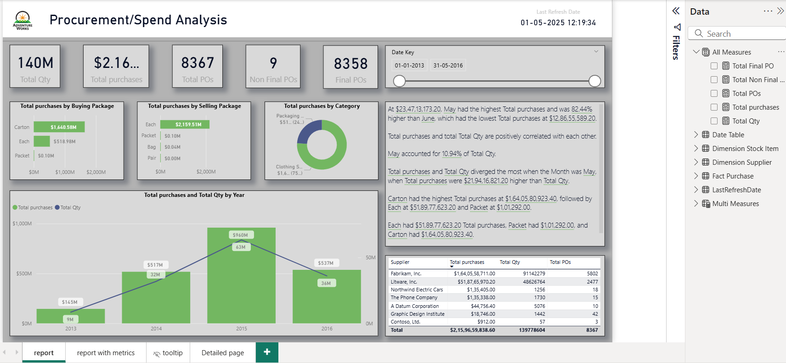

# PowerBI-Portfolio
A collection of Power BI project reports showcasing Visualization, data modeling, DAX, with slicers, drill through, Tooltip and metrics

##Projects

###1. Sales Analysis

This Power BI dashboard provides a comprehensive view of Internet Sales and Reseller Sales across six countries, product categories, and promotional strategies. It enables stakeholders to monitor performance, compare sales channels, and identify opportunities for margin optimization and regional growth.

Used many measures using DAX and utilized them in visuals

🎯 Objectives
- Compare profitability between Internet and Reseller sales channels
- Analyze sales distribution by category, promotion, and geography
- Enable dynamic filtering for personalized insights
- Support strategic decisions with clear KPIs and visual storytelling
- Enable to compare for different subcategories and different timeperiod by using Slicers

🛠️ Tools & Technologies
- Power BI Desktop
- DAX for margin calculations and dynamic KPIs
- Power Query (M) for data transformation
- DAX Measures (which are saved under ALL Measures table)
- Copilot for some insights and some Dax measures
- Dimensional Modeling using FactInternetSales, FactResellerSales, and related dimension tables

📐 Data Model
Star schema with fact tables for Internet and Reseller Sales, connected to dimensions like Product, Customer, Employee, Promotion, Geography, and Sales Territory.

📈 Key Visuals
- Cards for Total Sales, Total Cost, Margin, and Margin %
- Bar charts for Sales by Category
- Treemaps and donut charts for Sales by Region
- Pie charts for Sales by Promotion
- Slicers for Category, Subcategory, and Employee Name
- Date filter for dynamic time-based analysis

📌 Business Impact
- Enabled regional managers to compare Internet vs Reseller performance
- Identified high-margin categories and underperforming promotions
- Improved visibility into global sales trends, supporting quarterly strategy reviews

On the next page, the analysis is done by customer name with different measures.

On the next page, the analysis is done by Employee name with different measures.

On the next page, Sales-cost Margin Analysis is done by using metrics for both Internet and reseller Sales.

###2. Procurement or spend analysis

The Procurement / Spend Analysis Dashboard, built in Power BI, provides an interactive view of the company’s purchasing and spending trends. It highlights key metrics such as total purchases ($2.16B), total quantity (140M), and total purchase orders (8,367), enabling data-driven procurement decisions. The report visualizes top-performing suppliers, major spending categories, and package-wise purchase patterns while showcasing year-over-year purchase trends. This dashboard helps stakeholders identify cost-saving opportunities, evaluate supplier performance, and optimize procurement efficiency through clear, actionable insights.

On the next page, a metrics slicer is used. When one of the metric options is selected, the visualizations display trends based on that value.

On the next page, a tooltip page is built, which is used as tooltip in the report page.

On the next Drillthrough page is built named as Detailed page.

###3. Product Analysis

🧩 Overview
This dashboard provides a detailed analysis of product performance, reseller effectiveness, and category trends across six countries: United States, Canada, France, Germany, United Kingdom, and Australia. It empowers business stakeholders to examine unit sales, reseller growth, and category champions to support forecasting and inventory optimization.

🎯 Business Objective
To deliver actionable insights into reseller and sub-category unit sales trends. The dashboard helps supply chain managers identify best-selling products, underperforming regions, and top-performing resellers to guide purchasing and restocking strategies.

🛠️ Tools & Technologies
- Power BI Desktop & Service
- DAX for percentage calculations and ranking logic
- Power Query (M) for data processing
- Microsoft Copilot for generating subtitles and refining Q&A logic
- Star Schema Layout with FactResellerSales and Dim* tables
- 
📐 Data Model
Star schema with FactResellerSales connected to DimProduct, DimProductCategory, DimProductSubcategory, DimCustomer, DimGeography, DimDate, and DimPromotion.

📈 Key Visuals
- 📊 100% stacked column chart for monthly units sold by category
- 📊 Horizontal bar charts for:
- Top 10 resellers by quantity sold
- Top 10 resellers by retail sales
- Top 10 products by total units sold
- 📌 Text box with dynamic insights and highlights
- 🌍 Country and year slicers for comparative analysis

On the next page, a tooltip page is built, which is used as tooltip in the report page.

